# 🌐 Awesome Service Mesh Management

     

**Curated Directory of Commercial SaaS Platforms & Open-Source Tools for Microservices, mTLS Encryption & Kubernetes Traffic Engineering.**

---

## 📖 Overview & SEO Summary

A **Service Mesh** is a dedicated infrastructure layer for facilitating service-to-service communications between microservices, container workloads, and cloud environments. By delegating traffic routing, mutual TLS (mTLS) security, retry logic, load balancing, and distributed tracing to sidecar proxies (e.g., Envoy) or eBPF kernel modules, platform engineers and SREs gain operational transparency and zero-trust security without modifying application code.

This repository serves as an authoritative guide comparing enterprise commercial SaaS vendors and leading open-source projects across Kubernetes, multi-cloud, and edge architectures.

---

## 📋 Table of Contents

- [📊 Market Overview & Industry Structure](#-market-overview--industry-structure)
- [🏢 SaaS & Hosted Service Mesh Platforms](#-saas--hosted-service-mesh-platforms)
- [⚡ Open-Source Service Mesh Projects](#-open-source-service-mesh-projects)
- [🔬 Architecture Paradigms: Sidecar vs. Sidecarless (eBPF & Ambient)](#-architecture-paradigms-sidecar-vs-sidecarless-ebpf--ambient)
- [🛠️ Observability & Ecosystem Add-ons](#️-observability--ecosystem-add-ons)
- [🤝 How to Contribute](#-how-to-contribute)
- [💖 Support & Community](#-support--community)
- [⚖️ Disclaimer & Evaluation Criteria](#️-disclaimer--evaluation-criteria)
- [⭐ Star History](#-star-history)

---

## 📊 Market Overview & Industry Structure

> 📈 **Market Size & Dynamics**: The global **Service Mesh & Microservices Networking Software Market** was valued at **~$1.79B – $2.20B in 2025/2026** and is projected to expand to **$6.33B+ by 2030** at a **Compound Annual Growth Rate (CAGR) of ~28.7% – 32.6%**.
>
> 🧩 **Market Fragmentation**: The market is **moderately fragmented**. It features cloud hyperscalers (AWS), specialized enterprise networking unicorns (HashiCorp/IBM, Kong, Solo.io, Tetrate), and vendor-neutral open-source foundations (CNCF). No single vendor exercises a "winner-take-all" monopoly, as enterprise environments increasingly demand multi-cloud portability and CNCF-governed standards (Istio, Linkerd, Cilium).

---

## 🏢 SaaS & Hosted Service Mesh Platforms

The table below lists top commercial SaaS and managed enterprise service mesh platforms, **sorted by Company Size (Revenue / Valuation) in descending order**.

| 🏢 Platform / Product | 💼 Company Size & Valuation | 📝 Description & Best For | 💵 Specific Starting Pricing | 🎁 Free Tier / Trial Limit |
| :--- | :--- | :--- | :--- | :--- |
| 🚀 **[AWS App Mesh](https://aws.amazon.com/app-mesh/)** | **~$2.1T+ Market Cap** *(AWS Rev: ~$100B+/yr)* | AWS managed Envoy service mesh. Deeply integrated with Amazon EKS, ECS, Fargate, & CloudWatch. **Best for AWS-native microservices.** | `$0.00/hr` for control plane *(Pay only for underlying EC2/Fargate/EKS infrastructure)* | **100% Free Control Plane** forever *(Includes 12-mo AWS Free Tier: 750 hrs/mo EC2 & 5GB CloudWatch)* |
| 🔐 **[Consul (HashiCorp)](https://www.consul.io/)** | **$6.4 Billion** *(Acquired by IBM; IBM Cap: ~$210B+)* | Service discovery, mTLS service mesh (Connect), intentions-based authorization, & multi-datacenter federation. | `$0.027/node/hour` (~$19.71/node/month) for HCP Consul Pay-As-You-Go; Enterprise from `$50/node/month` | **$50 Free Trial Credits** on HCP Consul *(Equivalent to ~2,500 node-hours or 30 days for small clusters)* |
| 🦍 **[Kong Mesh](https://konghq.com/)** | **$1.4 Billion Valuation** *(Unicorn, $175M+ Raised)* | Enterprise multi-zone service mesh built on CNCF Kuma. Includes RBAC, enterprise GUI, & FIPS 140-2 compliance. **Best for Kong API ecosystem users.** | `$250/month` *(Kong Konnect Team Tier)* or `$0.05/node/hour` for enterprise usage | **14-Day Free Trial** on Kong Konnect Enterprise *(Up to 5 control planes & 20 data plane nodes)* |
| 🔮 **[Solo.io Gloo Mesh](https://www.solo.io/)** | **$1.0 Billion Valuation** *(Series C Unicorn)* | Enterprise Istio management & multi-cluster federation platform with Gloo Gateway & Gloo Network Core. **Best for large-scale enterprise Istio.** | `$30/node/month` or `$500/cluster/month` for basic enterprise core tier | **30-Day Free Trial License** *(Full enterprise feature access for up to 5 clusters)* |
| 🛡️ **[Tetrate Service Express](https://tetrate.io/)** | **~$500 Million Valuation** *(Series B $52.5M, Total: $84M+)* | Enterprise Istio platform focused on zero-trust security, multi-cloud governance, & seamless SLA compliance. **Best for regulated sectors.** | `$0.06/node/hour` (~$43.80/node/month) via AWS Marketplace or `$3,500/cluster/year` | **30-Day Free Trial** via AWS Marketplace / Tetrate Cloud *(Up to 10 nodes & 2 Kubernetes clusters)* |
| 🚦 **[Traefik Mesh Enterprise](https://traefik.io/)** | **~$120 Million Valuation** *(Series B $32M, Total: $43M)* | Lightweight, SMI-compliant service mesh built on Traefik proxy. Simple, non-invasive deployment without Envoy complexity. | `$14/instance/month` *(Traefik Hub Developer/Team Tier)* or `$0.02/node/hour` | **Free Forever Tier** on Traefik Hub *(Up to 5 microservices / 1 cluster)* or **14-Day Enterprise Trial** |

---

## ⚡ Open-Source Service Mesh Projects

The table below catalogs open-source service mesh projects and cloud-native proxies, **sorted by GitHub Star Count in descending order**. Click any star badge to inspect real-time stargazers!

| 📦 Repository & Project | ⭐ GitHub Stars (Stargazers Link) | 📜 License | 🏗️ Architecture & Core Highlights | 🎯 Primary Use Case |
| :--- | :--- | :--- | :--- | :--- |
| 🚦 **[Traefik Proxy](https://github.com/traefik/traefik)** |  | MIT | Go-based modern HTTP reverse proxy and ingress controller with native microservice discovery. | Dynamic ingress routing & microservice API edge proxy |
| ⛵ **[Istio](https://github.com/istio/istio)** |  | Apache-2.0 | CNCF Graduated standard. Envoy sidecar architecture + **Ambient Mesh** (sidecarless L4/L7 ztunnel & waypoint proxies). | Enterprise-grade Kubernetes mTLS, traffic shaping & zero trust |
| 🔒 **[Consul](https://github.com/hashicorp/consul)** |  | BUSL / MPL | Multi-datacenter service discovery, health monitoring, and Connect mTLS service mesh. | Hybrid cloud & multi-region service-to-service discovery |
| 🛡️ **[Envoy Proxy](https://github.com/envoyproxy/envoy)** |  | Apache-2.0 | CNCF Graduated C++ L7 cloud-native edge and service proxy. The foundation for Istio, Kuma, & App Mesh. | High-performance data plane for modern service meshes |
| 🐝 **[Cilium](https://github.com/cilium/cilium)** |  | Apache-2.0 | eBPF-based networking, security & sidecarless service mesh. Eliminates sidecar container latency overhead. | eBPF sidecarless Kubernetes networking, security & mesh |
| 🐟 **[Linkerd2](https://github.com/linkerd/linkerd2)** |  | Apache-2.0 | CNCF Graduated. Ultra-lightweight Rust micro-proxy (`linkerd2-proxy`). Unmatched latency & low memory consumption. | High-performance, low-overhead Kubernetes mTLS & mesh |
| ⚡ **[BFE Engine](https://github.com/bfenetworks/bfe)** |  | Apache-2.0 | CNCF Sandbox enterprise layer-7 load balancer and traffic management engine written in Go. | Large-scale L7 traffic routing & enterprise load balancing |
| 🐻 **[Kuma](https://github.com/kumahq/kuma)** |  | Apache-2.0 | CNCF Incubating universal Envoy-based mesh. Supports Kubernetes, VMs, bare metal, & multi-zone mesh. | Universal multi-zone mesh across Kubernetes & legacy VMs |
| 🌐 **[Open Service Mesh (OSM)](https://github.com/openservicemesh/osm)** |  | Apache-2.0 | SMI-compliant lightweight Envoy mesh *(Archived by CNCF in 2023; preserved for historical reference)*. | Historical SMI specification compliance reference |
| 🔀 **[Kube-router](https://github.com/cloudnativelabs/kube-router)** |  | Apache-2.0 | Lean Kubernetes networking tool combining IPVS-based service proxy, BGP router, and NetworkPolicy controller. | IPVS high-throughput Kubernetes networking & service proxy |
| 🕸️ **[Traefik Mesh](https://github.com/traefik/mesh)** |  | MIT | Simpler, non-invasive Kubernetes service mesh powered by Traefik proxies without sidecar injection. | Simpler Kubernetes service mesh for developer teams |
| 📐 **[SMI Spec](https://github.com/servicemeshinterface/smi-spec)** |  | Apache-2.0 | Service Mesh Interface (SMI) specification — standard interfaces for service mesh on Kubernetes. | Standardized Kubernetes service mesh API specification |
| 🍃 **[Flomesh Pipy](https://github.com/flomesh-io/pipy)** |  | MIT | Programmable modular network proxy written in C++ with JS scripting for cloud, edge, and IoT mesh. | High-performance programmable cloud/edge traffic proxy |
| 🌉 **[Merbridge](https://github.com/merbridge/merbridge)** |  | Apache-2.0 | eBPF plugin to accelerate Istio, Linkerd, and Kuma service meshes by bypassing iptables network stack. | eBPF network acceleration for sidecar service meshes |
| ✈️ **[Aeraki Mesh](https://github.com/aeraki-mesh/aeraki)** |  | Apache-2.0 | Manages non-HTTP layer 7 protocols (Dubbo, Thrift, Redis, Kafka) inside Istio service mesh environments. | L7 non-HTTP protocol governance in Istio service mesh |
| 🧩 **[NGINX Service Mesh](https://github.com/nginxinc/nginx-service-mesh)** |  | Apache-2.0 | Lightweight service mesh leveraging NGINX Plus sidecar proxies for traffic management and security. | NGINX-native enterprise Kubernetes service mesh |

---

## 🔬 Architecture Paradigms: Sidecar vs. Sidecarless (eBPF & Ambient)

```mermaid
flowchart TD
    subgraph Traditional Sidecar Pattern
        A1[Pod / Container A] -->|Loopback| S1[Envoy Sidecar Proxy]
        S1 -->|mTLS Encryption| S2[Envoy Sidecar Proxy]
        S2 -->|Loopback| B1[Pod / Container B]
    end

    subgraph Sidecarless eBPF & Ambient Mesh
        A2[Pod / Container C] -->|eBPF Socket / ztunnel| K[Linux Kernel eBPF L4]
        K -->|mTLS Tunnel| K2[Linux Kernel eBPF L4]
        K2 -->|Direct Delivery| B2[Pod / Container D]
    end

    style S1 fill:#3B82F6,color:#fff
    style S2 fill:#3B82F6,color:#fff
    style K fill:#EC4899,color:#fff
    style K2 fill:#EC4899,color:#fff
```

### 🔹 Sidecar Architecture (Envoy / Rust Proxy)
- **Mechanism**: Attaches a dedicated proxy container alongside each application container.
- **Pros**: Rich L7 traffic policies, granular per-pod isolation, mature ecosystem.
- **Cons**: Increased memory footprint per pod, network hop latency from `iptables` redirection.

### ⚡ Sidecarless Architecture (eBPF & Istio Ambient)
- **Mechanism**: Moves L4 connection security (`ztunnel`) and eBPF socket filtering directly into the kernel or node daemon set, using shared waypoint proxies for L7 routing only when required.
- **Pros**: **Zero application pod modification**, reduced CPU/memory overhead by up to 70%, lower packet latency.
- **Leaders**: **Cilium Service Mesh** (pure eBPF) & **Istio Ambient Mesh**.

---

## 🛠️ Observability & Ecosystem Add-ons

Complementary open-source tools required for full service mesh telemetry:

- 📊 **[Prometheus](https://github.com/prometheus/prometheus)** — Time-series metrics collection for proxy throughput, latency (P99/P95), and error rates.
- 📈 **[Grafana](https://github.com/grafana/grafana)** — Visual dashboarding for RED (Rates, Errors, Duration) metrics.
- 🔍 **[Jaeger Tracing](https://github.com/jaegertracing/jaeger)** — OpenTracing / OpenTelemetry compliant distributed request tracing across microservice hops.
- 👁️ **[Kiali](https://github.com/kiali/kiali)** — Visual topology console specifically designed for Istio service mesh inspection.
- 📡 **[OpenTelemetry](https://github.com/open-telemetry/opentelemetry-collector)** — Vendor-neutral telemetry collector for traces, metrics, and logs.

---

## 🤝 How to Contribute

Contributions are welcome! Please follow these simple guidelines:

1. **Fork the repository** on GitHub.
2. Edit `README.md` to add or update entry details.
3. Ensure pricing, company valuation/revenue, and free tier limits are factual and verified.
4. Keep descriptions concise (1–2 sentences).
5. Submit a Pull Request (PR) with a clear title and summary of changes.

---

## 💖 Support & Community

Thank you for exploring **Awesome Service Mesh Management**! If you find this curated directory helpful for your team, microservice architecture, or technical research, please consider supporting the project:

- ⭐ **Star this repository** on GitHub to help others discover it.
- 🔀 **Fork & Share** it with your fellow platform engineers, SREs, and DevOps communities.
- ☕ **Sponsor / Buy me a coffee**: If you'd like to support ongoing updates and open-source curation, visit the [Sponsor Dashboard](https://github.com/sponsors/ishandutta2007).

---

## ⚖️ Disclaimer & Evaluation Criteria

- This directory is **community-curated** for educational and architectural reference.
- Service mesh platforms introduce operational overhead (certificate rotation, control plane updates, proxy sidecar memory footprint). Evaluate team capacity and benchmark performance before production deployment.
- Pricing details, free trial terms, and GitHub star counts are subject to change over time.

---

## ⭐ Star History

---

  Made with ❤️ for platform engineers, SREs, and cloud-native architects.

